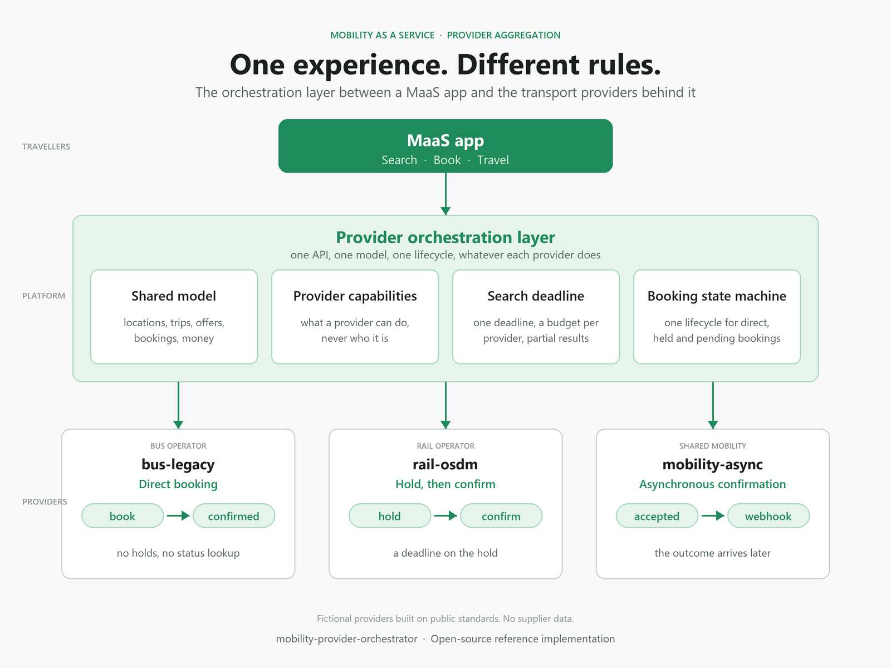

# mobility-provider-orchestrator

[](https://github.com/MohamedEldafrawi2/mobility-provider-orchestrator/actions/workflows/ci.yml)
[](https://www.python.org/downloads/release/python-3130/)
[](https://mypy-lang.org/)
[](https://github.com/astral-sh/ruff)
[](LICENSE)



One booking API over transport providers that differ in protocol, booking semantics, idempotency,
reliability and after-sales support. The interesting problem is not the API. It is what the
platform does when a provider times out after possibly creating a reservation, when a webhook and
a poll disagree, or when a provider offers no way to find out what happened.

This repository is a complete, tested answer to that problem, built from scratch on public
standards and three fictional providers. No proprietary API, schema or documentation was used;
the sources are listed in [`docs/references.md`](docs/references.md).

## What it does

- **Search** fans out to every provider under one deadline with per-provider budgets, returns
  partial results with a per-provider report, and never competes with completion for a
  provider's allowance.
- **Booking** handles three flows through one API: direct confirmation, hold-then-confirm before
  a deadline, and asynchronous confirmation by signed webhook.
- **Cancellation** runs under terms the client authorised: the refund quote is validated,
  persisted and accepted by its exact identity.
- **Recovery** never guesses. A lost answer is resubmitted under the same key where the provider
  binds keys before execution, settled by a fenced lookup where the provider offers finality, and
  otherwise kept as durable, visible uncertainty in a review case.
- **Review** gives operators evidence, not override: a case closes only when its complete
  evidence set allows it.
- **Observability**: structured logs with correlation ids, OpenTelemetry metrics and traces, a
  Grafana dashboard and alert rules for the properties the design commits to.

## The idea in one paragraph

Every provider call is journaled before any network IO as an attempt that *may* have an effect,
with a short expiry inside an absolute command cutoff. Every conclusion carries its evidence:
a provider answer, an authoritative read, or a fenced lookup that serialises with in-flight
mutations. Elapsed time alone never settles anything. What the platform cannot prove it says
plainly, in a state clients can see and operators can act on. The
[architecture document](docs/architecture.md) explains how that shapes everything else.

## Run it

Requires Docker.

```bash
cp .env.example .env
make up-dev                      # API on :8000, admin on 127.0.0.1:8001, simulators on loopback
make demo                        # a guided tour: search, three booking flows, two faults, a review
```

The demo prints every request it makes and what came back. To see the platform's internals while
it runs:

```bash
make up-observability            # adds Prometheus, Grafana (127.0.0.1:3000) and Jaeger (127.0.0.1:16686)
```

A minimal exchange by hand:

```bash
curl -s -H "X-API-Key: dev-client-key" \
  "localhost:8000/v1/trips?from=loc_rail_8500010&to=loc_rail_8503000&departureDate=2026-06-15" | jq '.providers'

curl -s -X POST -H "X-API-Key: dev-client-key" -H "Idempotency-Key: $(uuidgen)" \
  -H "Content-Type: application/json" localhost:8000/v1/bookings \
  -d '{"offer_id":"<an offer id from the search>","passengers":[{"full_name":"Ada Lovelace"}],"contact_email":"ada@example.org"}'
```

## The three providers

| | rail-osdm | bus-legacy | mobility-async |
|---|---|---|---|
| modelled after | public OSDM concepts (loosely) | a proprietary legacy API | a modern asynchronous API |
| flow | hold, then confirm before a deadline | direct | accepted now, confirmed later by webhook |
| idempotent create | key bound before execution | none | client reference bound before execution |
| execution expiry, fenced lookup | yes | no | yes |
| cancellation | refund quote under authorised terms | none | free, idempotent |
| the hard part | a hold that expires on the provider's clock | a lost answer that can never be settled | ordering webhooks and polls |

Each is a small FastAPI application with its own SQLite file and chaos controls: latency, random
edge failures, rate limits, lagging indexes, and named failpoints that pause a handler between
its checks and its commit or lose an answer after the commit. They are fictional; the integration
guide says how a real one would be added.

## Documentation

| Document | What it covers |
|---|---|
| [Architecture](docs/architecture.md) | the shape, the layers, the domain model, the request and recovery paths |
| [Booking state machine](docs/booking-state-machine.md) | states, triggers, commands, attempts, dispositions, review closure |
| [Provider integration guide](docs/provider-integration-guide.md) | the port, side-effect classification, capabilities, what each capability buys |
| [Resilience strategy](docs/resilience-strategy.md) | admission by purpose, fail-closed quota, the measured load envelope |
| [Scaling](docs/scaling.md) | what scales how, the limits accepted on purpose, the named step-ups |
| [API reference](docs/api.md) | endpoints, the error catalogue, idempotent replays |
| [Edge cases](docs/edge-cases.md) | the fifty-four situations the design is built around and the mechanism for each |
| [Decision records](docs/adr/README.md) | fourteen decisions and their consequences |
| [References](docs/references.md) | the public standards and sources used |

## Develop

Requires [uv](https://docs.astral.sh/uv/) and Docker (integration tests use testcontainers).

```bash
uv sync --all-groups
make check            # ruff, mypy strict, import-linter contracts, all tests
make test-unit        # unit, simulator, contract and model-based tests; no Docker needed
make test-integration # the platform against real PostgreSQL, Redis and the simulators
make bench            # the admission envelope in memory, then the path through the real stack
```

The test suite has five layers: unit tests over the pure domain; simulator tests proving each
fictional provider behaves as documented, including inside its serialised commit; contract tests
proving every declared capability against the simulator; model-based tests that drive the real
settlement predicates from independent reference models under Hypothesis; and integration tests
for races, forced interleavings and convergence under random faults, judged against the
simulators' truth.

## Layout

```
src/orchestrator/
  domain/        the model: states, commands, attempts, settlement predicates, capabilities. No IO.
  providers/     the port, the registry, the three adapters, transport by purpose
  resilience/    admission by purpose: bulkheads, breakers, quota, retry tokens, the attempt loop
  application/   use cases: search, booking, confirmation, cancellation, recovery, webhooks, review
  persistence/   SQLAlchemy models, the unit of work, the booking store
  api/           public and admin applications, authentication, problem details
  worker/        leased loops over the bookings table
  telemetry/     structured logging, metrics, tracing
src/provider_sims/   the three fictional providers with chaos controls
migrations/          Alembic
benchmarks/          the load envelope, in memory and through the real stack
observability/       Prometheus, alert rules, Grafana dashboard, collector configuration
tests/               unit, sims, contract, model, integration
```

## Status and scope

The behaviour described here is implemented and covered by the test layers above; the
limits accepted on purpose are listed in the architecture document. Deliberately out of scope: a fulfilment
model (tickets), client-facing webhooks, automatic cancellation of a discovered duplicate (a
human stays in that loop), currency conversion, and real provider credentials. The
[architecture document](docs/architecture.md) lists the limits accepted on purpose.

## License

MIT. See [LICENSE](LICENSE).
