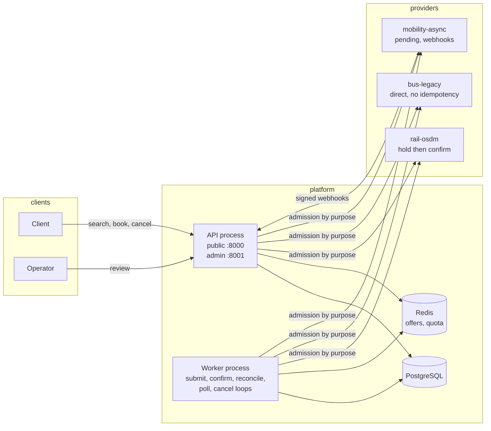
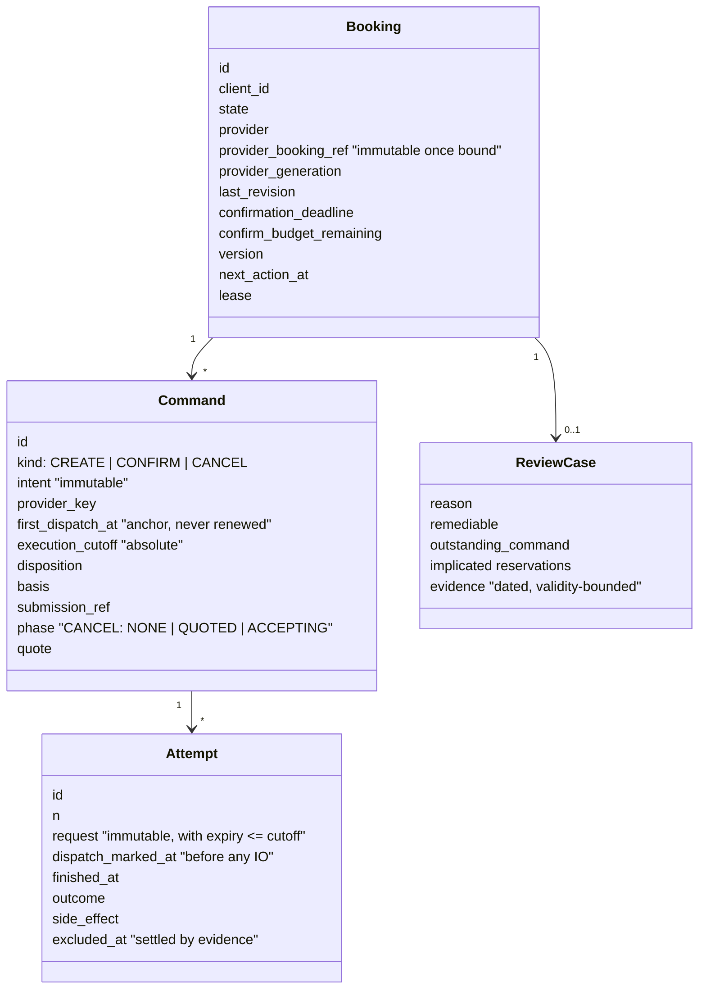
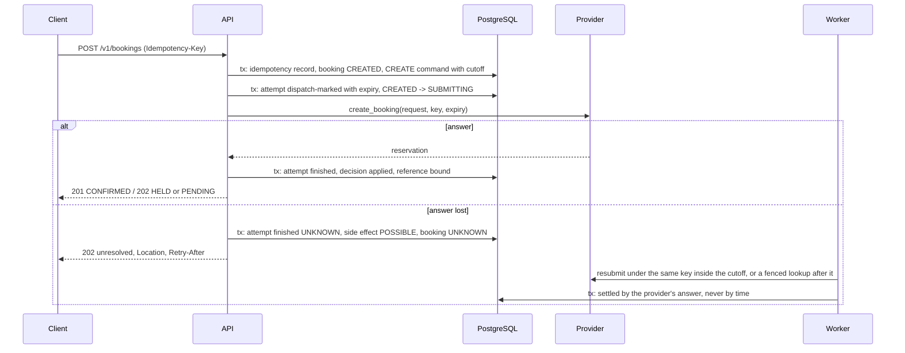

# Architecture

One unified booking API over transport providers that differ in protocol, booking semantics,
idempotency, reliability and after-sales support. The hard part is not the API. It is what the
platform does when a provider times out after possibly creating a reservation, when a webhook
and a poll disagree, or when a provider offers no way to find out what happened. This document
explains the shape of the answer; the companion documents go deeper on the
[state machine](booking-state-machine.md), [provider integration](provider-integration-guide.md),
[resilience](resilience-strategy.md), [scaling](scaling.md) and the [decisions](adr/README.md).

## The one idea

**The platform never guesses.** Every claim it makes about a reservation carries the evidence
that justifies it, and when it has no evidence it says so, durably, in a state a client can see
and an operator can act on. Three consequences shape everything else:

1. **Dispatch is journaled before any network IO.** A provider call is preceded by a committed
   record that says "this attempt may have an effect from now on". Whatever happens next, the
   platform knows it may owe the provider a question.
2. **Finality is a provider feature.** The platform concludes "it did not happen" only when the
   provider offers a *fenced lookup*: a read that serialises with every in-flight mutation of the
   key and fences later ones. A clock check is not finality. Without it, a possibly executed
   command that never becomes visible stays `UNRESOLVED` in an open review case.
3. **Nothing is settled by elapsed time.** A hold is expired when the provider says so. An
   attempt is excluded when a read after its expiry plus the provider's declared clock skew
   shows nothing. A review case closes when its complete evidence set allows it.

## Shape



A **modular monolith** with two process roles over one database. The API serves clients on a
public listener and operators on a separate admin listener that is never published. The worker
runs the recovery loops. Both roles share one code base and one set of services; they differ in
what they listen to.

## Layers

```
src/orchestrator/
  domain/        the model: states, commands, attempts, settlement predicates, capabilities. No IO.
  providers/     the port, the registry, the three adapters, transport by purpose
  resilience/    admission by purpose: bulkheads, breakers, quota, retry tokens, the attempt loop
  application/   use cases: search, booking creation, confirmation, cancellation, recovery,
                 webhooks, review; wiring
  persistence/   SQLAlchemy models, the unit of work, the booking store, migrations
  api/           public and admin applications, authentication, problem details
  worker/        leased loops over the bookings table
  telemetry/     structured logging, metrics, tracing
src/provider_sims/   the three fictional providers, each with chaos controls; import nothing from the platform
```

An import-linter contract enforces the layering: `domain` imports nothing from the project;
`providers` and `persistence` import `domain`; `resilience` sits between; `application` imports
all of them; `api` and `worker` import `application`. The domain is pure functions over frozen
dataclasses, which is what makes the model-based tests possible.

## The domain model



A **command** is one client intent with one provider key, one first-dispatch anchor and one
absolute execution cutoff. It owns **attempts**, each with an immutable request and a short
expiry inside the cutoff. Attempts settle individually (an answer, or evidence that excludes
their effect); the command settles when every possible effect is confirmed or excluded. A
**disposition** always carries its **basis**: `PROVIDER_RESULT`, `LOOKUP`, `FENCED_LOOKUP` or
`LOCAL`, and the domain refuses combinations that would claim more than the evidence supports.

Money is integer minor units with a currency. Times are timezone-aware, always. Offer ids are
opaque and provider-scoped. A booking's provider reference is immutable once bound.

## Providers as capabilities

The platform reasons about what a provider **can do**, declared by its adapter and proven by
contract tests, never about which provider it is:

| | rail-osdm | bus-legacy | mobility-async |
|---|---|---|---|
| flow | hold, then confirm before a deadline | direct | accepted now, confirmed later by webhook |
| idempotent create | key bound before execution | none | client reference bound before execution |
| execution expiry, fenced lookup | yes | no | yes |
| cancellation | by refund quote under authorised terms | none | free, idempotent |
| ordering | revision and generation | none | revision and generation |

Provider B is deliberately the worst case. A B command that may have executed and never becomes
visible stays unresolved. That is a supported outcome: one unsafe dispatch per command, durable
uncertainty, an open case, never a silent `FAILED`.

## Request and recovery paths



The request path does the work that can be done now, including confirming a hold immediately.
Anything it cannot finish is owned by a worker loop through a **lease** on the booking row:
submission, confirmation (on a reserved connection pool slice, imminent deadlines first),
reconciliation of unknown outcomes, polling of pending bookings, cancellation. Every worker write
is fenced by its lease token; a stale worker cannot overwrite a newer one.

## Admission by purpose

Every provider call passes through one of five purposes, each with its own bulkhead, sliding
window circuit breaker, share of the provider's allowance (a two-bucket quota in Redis that
fails closed), retry tokens and HTTP client. Search can saturate its share; it cannot touch the
floor reserved for confirmations, cancellations and lookups. The platform side is partitioned
too: the confirmation loop runs on its own pool slice. The design states a load envelope and
measures it; see [resilience](resilience-strategy.md).

## Observations and ordering

Webhooks and polls are **observations**. Each is checked against the bound reference, then
ordered by the provider's generation and revision: an older fact never overwrites a newer one,
a newer generation is adopted only from an authoritative read, an authoritative read behind what
was already applied is quarantined for review. An observation that confirms the current state
still advances the watermark. Receipt and application happen in one transaction under the
booking's row lock, so a duplicate delivery is the receipts table's unique constraint firing,
and two receivers of the same event apply it once.

An event that overtakes the create response, naming a booking with no bound reference yet, is
never applied on its own word: an authoritative read of the reservation it names must agree on
both references, or the disagreement is contradictory evidence for review.

## Review

A review case lists every implicated reservation and the dated, validity-bounded evidence about
it. Operators can reconcile (run authoritative lookups now) and resolve (close the case into the
state the evidence supports, under `expected_version`). There is no override: a case closes
only when its complete evidence set allows it, and a cancellation case is judged by the exact
refund offer the client accepted. Under review nothing else moves the booking: late answers,
uncertain outcomes and webhooks become evidence and the case decides.

## Idempotency

A client key maps immutably to one command. The initial response and every replay come from one
function over the command's disposition, so they cannot disagree: `OPEN` and `UNRESOLVED` replay
as 202, `SUCCEEDED` as the original success with the booking's *current* state, `REJECTED` as
422 `booking-rejected`, a refused cancellation as 409. Concurrent identical requests race for
the unique `(client, key)` row; the loser replays the winner.

## Search

One request deadline, a smaller budget per provider, no retries, its own admission purpose. A
catalogue round decides coverage, a trips round asks only the covering providers; stragglers are
cancelled and the response carries a per-provider report. Partial results are the normal case;
503 means no covering provider answered.

## What is deliberately not here

- No workflow engine: the state machine is the product, and it is a table in the domain.
- No message broker: the bookings table is the work source, claimed with `SKIP LOCKED` and
  fenced by leases.
- No cross-provider deduplication of offers, no currency conversion, no search cache.
- No automatic cancellation of a duplicate reservation (`CANCEL_EXTRA` is modelled, its execution
  is left to operators): a duplicate is money, and the design keeps a human in that loop.
- No fulfilment model (tickets), no client-facing webhooks, no real provider credentials. The
  providers are fictional and the protocols are public standards, loosely followed.
