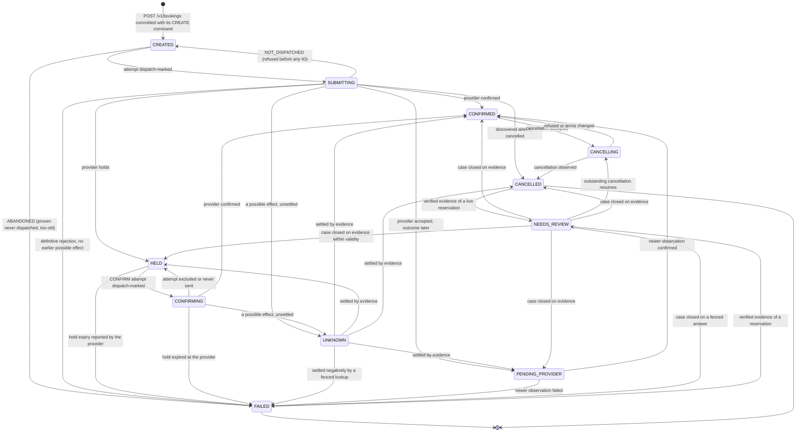
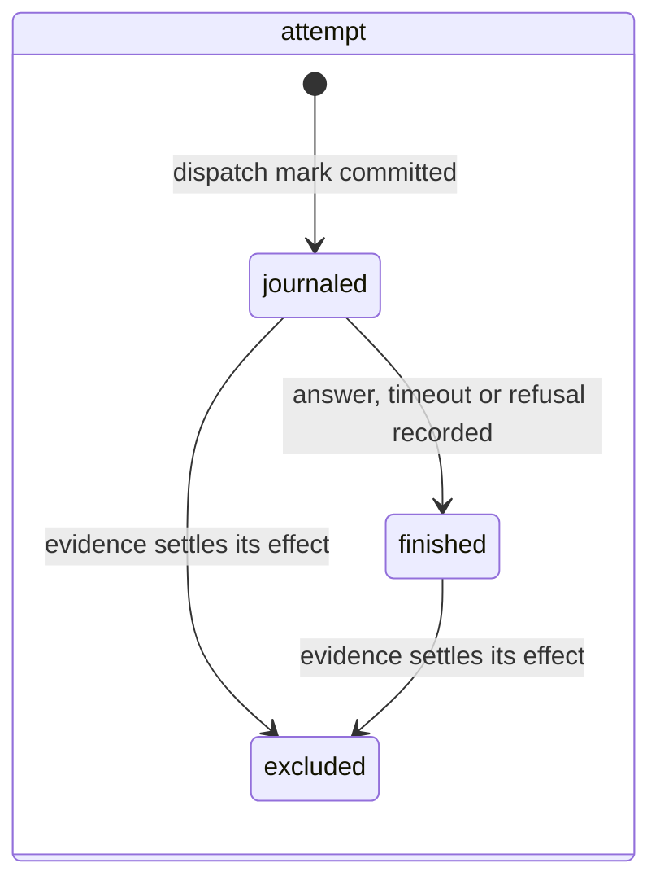

# The booking state machine

A booking's state describes the **last accepted observation about it**, never a guess. Every
transition is a pure function in the domain layer (`orchestrator.domain.states`), table-driven,
total (an unknown pair returns `InvalidTransition`, it never raises) and exhaustively tested. The
application applies transitions under the booking's row lock, fenced by the worker's lease, in
the same transaction as the command disposition that justifies them.

## States

| State | Meaning | Owner |
|---|---|---|
| `CREATED` | Accepted from the client; nothing has been sent to a provider yet | request handler, then the submission loop |
| `SUBMITTING` | A CREATE attempt is dispatch-marked; its answer is awaited | the caller that journaled it; stale rows are recovered by the worker |
| `HELD` | The provider holds a reservation with a deadline (hold-then-confirm providers) | the confirmation loop |
| `CONFIRMING` | A CONFIRM attempt is dispatch-marked | the caller that journaled it |
| `PENDING_PROVIDER` | The provider accepted and will confirm or fail on its own schedule | the poller and inbound webhooks |
| `UNKNOWN` | A command may have executed; the platform does not yet know whether it did | the reconciliation loop |
| `CONFIRMED` | A confirmed reservation exists under the bound reference | nobody; a cancellation may begin |
| `CANCELLING` | A CANCEL command is in progress (phases `NONE`, `QUOTED`, `ACCEPTING`) | the cancellation loop |
| `NEEDS_REVIEW` | A review case is open; only its evidence can move the booking | operators and the review service |
| `FAILED` | Terminal: no reservation exists, settled by evidence | reopens only on verified evidence |
| `CANCELLED` | Terminal: the reservation was cancelled | reopens only on verified evidence |

`FAILED` and `CANCELLED` are terminal. Everything else is bounded: a booking either progresses
or enters review with a reason within a configured time. Nothing is ever left silently in
flight.

## Transitions

Every non-terminal, non-review state can also take `ESCALATE_REVIEW` into `NEEDS_REVIEW`:
contradictory evidence opens a case from anywhere.

## Triggers and what justifies them

| Trigger | Fired by | Evidence |
|---|---|---|
| `ATTEMPT_DISPATCHED` | the journal entry written before any network IO | none needed; it is the platform's own act |
| `NOT_DISPATCHED` | admission refused the attempt after the mark, before the IO | the attempt is finished `NOT_DISPATCHED` |
| `ABANDONED` | the submission loop, for a CREATE never dispatched within `abandon_after` | the command has no dispatch mark at all |
| `PROVIDER_CONFIRMED`, `PROVIDER_HELD`, `PROVIDER_PENDING`, `PROVIDER_REJECTED`, `PROVIDER_CANCELLED` | a provider answer, an authoritative read, a fenced lookup or an ordered webhook | the reservation echoes our reference and identity; ordering rules of generation and revision hold |
| `HOLD_EXPIRED` | the provider reports the hold expired, in an answer or a read | never elapsed time alone |
| `OUTCOME_UNCERTAIN` | an attempt with a possible effect that nothing has settled | the attempt's record |
| `ATTEMPT_EXCLUDED` | evidence that the attempt did nothing while the hold lives | a read after the attempt's expiry plus skew, or a definitive "request expired" |
| `ESCALATE_REVIEW` | contradictory, duplicate or unverifiable evidence | the review case records the reason and the implicated reservations |
| `CANCEL_ACCEPTED`, `CANCEL_REFUSED`, `CANCEL_RESUMED` | the cancellation service and the review service | the CANCEL command's disposition and phase |
| `VERIFIED_RESERVATION_ON_TERMINAL` | a verified reservation appears for a booking believed terminal | the reservation carries our reference and identity |

## Commands, attempts and dispositions

A booking owns **commands** (`CREATE`, `CONFIRM`, `CANCEL`; `CANCEL_EXTRA` is modelled but its
execution is out of scope). A command has an immutable intent, a provider key, a first-dispatch
anchor and an absolute **execution cutoff**. It owns **attempts**, each with its own immutable
request and a short **expiry** at or below the cutoff.

An attempt's **effective side effect** is what the platform must assume right now:
`NOT_DISPATCHED` before the mark, `POSSIBLE` from the mark until an answer says otherwise or
evidence excludes it, `NONE` when the provider certainly did nothing. A command **may have
executed** while any attempt is `POSSIBLE`.

| Disposition | Meaning | Basis allowed |
|---|---|---|
| `OPEN` | still in progress | none |
| `SUCCEEDED` | the effect happened; a reference is bound | `PROVIDER_RESULT`, `LOOKUP`, `FENCED_LOOKUP` |
| `REJECTED` | the effect certainly did not happen | `PROVIDER_RESULT` only when no attempt may have executed; otherwise `FENCED_LOOKUP` |
| `REFUSED`, `TERMS_CHANGED` | a cancellation the provider refused, or quoted on worse terms than authorised | as `REJECTED` |
| `UNRESOLVED` | review owns it; nothing about the provider is claimed | `LOOKUP`, `LOCAL` |
| `ABANDONED` | proven never dispatched | `LOCAL` only |

The rules the domain enforces (and `InvariantError` guards):

- a plain lookup never settles a command negatively;
- a provider result never settles a command negatively while an attempt may have executed;
- a fenced basis needs a provider that offers a fenced lookup;
- `SUCCEEDED` needs a bound reference; a bound reference is immutable;
- `ABANDONED` needs zero dispatch marks.

## Review cases

A case records the reason, whether it is remediable, the outstanding command and every
**implicated reservation**. Evidence is dated and, for a live hold, bounded by its validity. A
case closes only when its complete evidence set says so:

1. every implicated reservation has affirmative, unexpired evidence;
2. a live reservation that verifiably belongs to another client is accounted for and competes
   for nothing;
3. at most one live reservation of ours remains, and it is the bound reference, verifiably the
   one the command asked for (our reference, product and service date);
4. a cancellation case closes into `CANCELLED` only when the exact refund offer the client
   accepted is confirmed (or, for a free cancellation, the reservation is cancelled).

Under review, nothing moves the booking but the case's evidence: a late attempt outcome, an
uncertain answer or a webhook that arrives meanwhile is recorded (on the command, or as
quarantined evidence) and the case decides. Cases for a provider without finality may stay open
indefinitely. That is a supported, visible outcome, never a silent `FAILED`.
